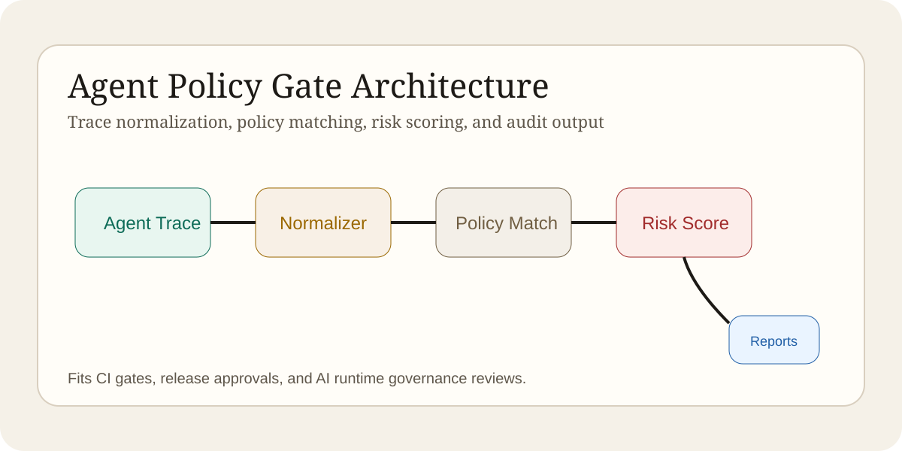
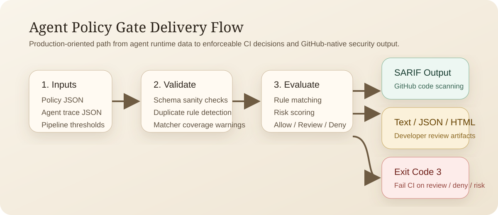
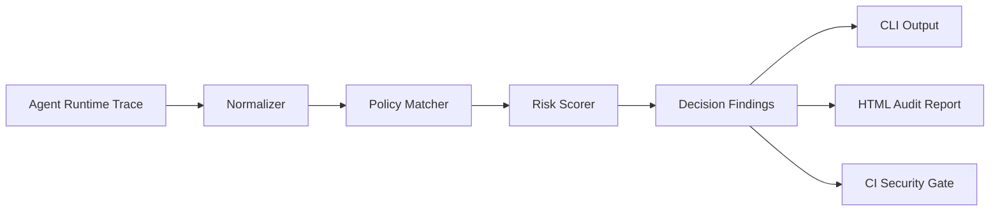
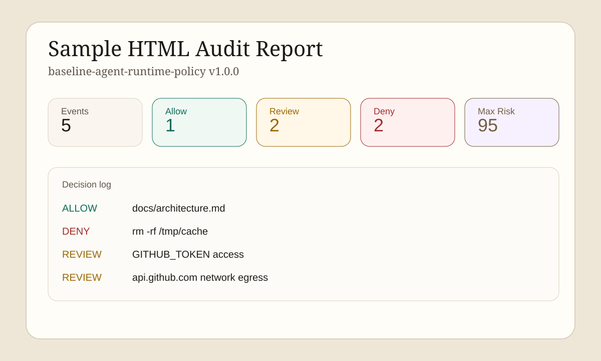

# Agent Policy Gate

Policy evaluation and audit reporting for AI agent tool execution. Agent Policy Gate helps platform teams review tool traces, deny unsafe actions, and generate lightweight security reports without depending on a heavyweight policy engine.




## Why this project exists

Agentic systems increasingly mix shell access, filesystem mutation, outbound network traffic, and secret-bearing environments. That turns ordinary "tool calls" into production change events. This repository demonstrates a staff-level approach to AI runtime governance:

- Normalize agent traces into a deterministic event model.
- Evaluate traces against explicit allow, review, and deny rules.
- Render security posture reports in text, JSON, and HTML.
- Export SARIF findings for GitHub-native security workflows.
- Fail CI deterministically on deny, review, or risk threshold conditions.
- Package the project as a reusable CLI suitable for CI gates and demo environments.

## Core capabilities

- Policy document format for actions, tools, resource prefixes, command patterns, domains, env vars, and risk thresholds.
- Heuristic risk scoring for destructive shell access, secret exposure, non-internal egress, and out-of-workspace writes.
- Human-readable HTML reporting for demos, governance reviews, and artifact retention.
- Standard-library-first implementation that runs in constrained environments.

## Architecture



## Quickstart

```bash
git clone https://github.com/Lord-Ark/agent-policy-gate.git
cd agent-policy-gate
python3 -m venv .venv
source .venv/bin/activate
pip install -e .
apg evaluate --policy examples/policy.json --trace examples/trace.json
apg evaluate --policy examples/policy.json --trace examples/trace.json --format html --output report.html
apg evaluate --policy examples/policy.json --trace examples/trace.json --format sarif --output report.sarif
apg evaluate --policy examples/policy.json --trace examples/trace.json --fail-on deny
apg validate --policy examples/policy.json
```

## Example output



Text report excerpt:

```text
Policy: baseline-agent-runtime-policy v1.0.0
Summary: 5 events, 1 allow, 2 review, 2 deny, max risk 95
```

Summary counts are rolled up per event using the most restrictive matched decision, while the detailed findings still include every matching rule.

## Repository layout

```text
src/agent_policy_gate/  core library, CLI, renderers
tests/                  unit coverage for engine and CLI
examples/               sample policy and trace data
docs/assets/            architecture and demo visuals
.github/workflows/      CI pipeline
```

## Installation

```bash
pip install -e .
```

## Usage

```bash
apg --version
apg evaluate --policy path/to/policy.json --trace path/to/trace.json --format text
apg evaluate --policy path/to/policy.json --trace path/to/trace.json --format json
apg evaluate --policy path/to/policy.json --trace path/to/trace.json --format html --output report.html
apg evaluate --policy path/to/policy.json --trace path/to/trace.json --format sarif --output report.sarif
apg evaluate --policy path/to/policy.json --trace path/to/trace.json --fail-on review
apg evaluate --policy path/to/policy.json --trace path/to/trace.json --risk-threshold 90
apg validate --policy path/to/policy.json --format json
cat path/to/trace.json | apg evaluate --policy examples/policy.json --trace -
cat path/to/policy.json | apg validate --policy - --format json
```

CI-oriented controls:

- `--fail-on deny` exits `3` when any deny finding is present.
- `--fail-on review` exits `3` when any review or deny finding is present.
- `--risk-threshold N` exits `3` when the highest derived risk score is at least `N`.
- `validate` catches malformed policies before a pipeline evaluates real traces.

Policy schema highlights:

- `default_action`: fallback decision when no rules match.
- `actions`: match event types such as `read`, `write`, `execute`, `network`.
- `resource_prefixes`: constrain filesystem or logical resource targets.
- `command_patterns`: shell-style patterns for command matching.
- `env_var_patterns`: secret-oriented env var detection.
- `risk_threshold`: only trigger a rule when the derived score crosses the threshold.

Trace inputs may be a single event object, an array of events, or an object that wraps either shape under an `events` key.

Use `-` for `--policy` or `--trace` to read JSON from stdin. During `evaluate`, only one of those flags may use stdin in the same invocation.

## GitHub security integration

Generate SARIF and upload it in a downstream workflow or security pipeline:

```bash
apg evaluate \
  --policy examples/policy.json \
  --trace examples/trace.json \
  --format sarif \
  --output report.sarif
```

This makes the project suitable for code scanning style ingestion, retention as a build artifact, and automated posture reviews inside broader DevSecOps controls.

## CI and quality gates

The repository includes a GitHub Actions workflow that runs:

- policy validation for the sample rule set
- syntax checks via `compileall` and `py_compile`
- unit tests with `unittest`
- CLI smoke evaluation against the sample policy and trace
- SARIF generation smoke coverage
- exit-code enforcement smoke coverage for CI gates

## Roadmap

- Support signed policy bundles and integrity checks for enterprise distribution.
- Emit OpenTelemetry spans and metrics for runtime governance observability.
- Add policy exceptions with approval ticket references and expiry dates.

## Contributing

See [CONTRIBUTING.md](CONTRIBUTING.md) for development workflow, standards, and release expectations.

## License

MIT. See [LICENSE](LICENSE).
